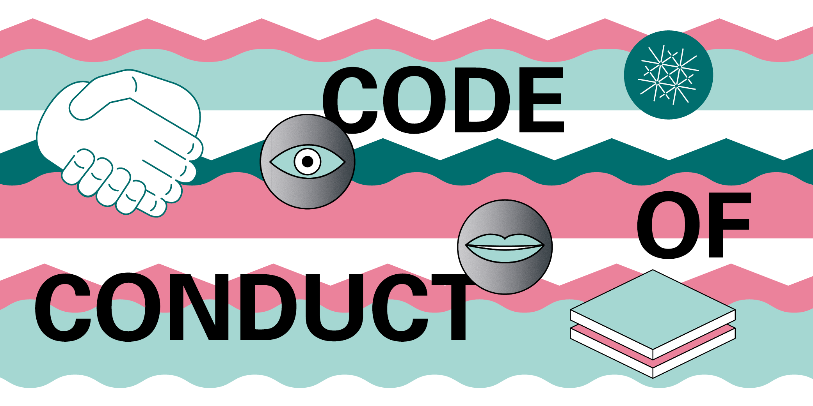

# Course Addenda

Perspectives of Digital Musiology

## Info

#### Instructors
* Email: stefan.muennich(at)unibas.ch

* Schedule/meeting info: [https://vorlesungsverzeichnis.unibas.ch/de/vorlesungsverzeichnis?id=296916](https://vorlesungsverzeichnis.unibas.ch/de/vorlesungsverzeichnis?id=296916)

Please read this addendum to the general course outline carefully. It is your guide to the course requirements and activities.

Please refer to the course outline for learning outcomes, course description and text and materials. 

Please also visit [AI in learning and teaching](https://www.unibas.ch/en/Studies/Learning-and-Teaching/AI-in-learning-and-teaching.html) for key information about guidelines from the University of Basel for the use of AI-based tools.

## Course Policy

In order to pass the course you need to:

* regularly and actively participate.
* engage with the assignments.
* moderate a brief discussion of one assignment / content-related topic.
* write a brief essay (and re-essay).
* miss max. 3 times with excuse.

## Time line

| Week | Topics | Readings | Assignments |
|---|---|---|---|
| **Block I: Introduction** ||||
| [week 1](./weeks/week-01.md) (25.9.) | Organization   What is Digital Musicology? ([Slides](https://docs.google.com/presentation/d/1inI_F-aKecElv-lZWA4FEf9SjsUa8Cf0Gu9lYPZgk0s/edit?usp=sharing)) | --- | [Assignment 1](./assignments/assignment-1.md) |
| [week 2](./weeks/week-02.md) (2.10.) | Data in Musicology |  Pugin, Laurent: “The challenge of data in digital musicology”, in: *Frontiers in Digital Humanities* 2 (2015). DOI: https://doi.org/10.3389/fdigh.2015.00004  | [Assignment 2](./assignments/assignment-2.md) |
| **Block II: Methods and Technologies** ||||
| week 3 (9.10.) | Music Encoding and Digital Editions | Teich Geertinger, Axel: “Digital Encoding of Music Notation with MEI”, in: *Notated Music in the Digital Sphere. Possibilities and Limitations* (2021). URL: https://issuu.com/nasjonalbiblioteket/docs/nota_bene_15_layout_issuu/35 | |
| week 4 (16.10.) | Optical Music Recognition (OMR) | | |
| week 5 (23.10.)| Music Information Retrieval (MIR) | | |
| break week (30.10.) | --- | --- | --- |
| week 6 (6.11.) | Computer-Assisted Music Analysis | | |
| **Block III: Critical Reflection** ||||
| week 7 (13.11.) | Critical Perspectives on Digital Methods / Use of AI (Part 1) | | |
| week 8 (20.11.) | Critical Perspectives on Digital Methods / Use of AI (Part 2) | | |  
| **Block IV: Applications and Examples** ||||
| week 9 (27.11.) | Digital Musicology Using the Example of the Eurovision Song Contest | | |
| week 10 (4.12.) | TBA | | |
| week 11 (11.12.) | TBA | | |
| week 12 (18.12.) | Summary and Final Discussion | | |

## Resources

### XML editors

XML files can be opened and edited with any text editor. The most widely used and with specific support for TEI currently are:
- [oXygen](https://www.oxygenxml.com/) (licensed)
- [Visual Studio Code](https://code.visualstudio.com/) (free). How to use VSCode for [XML and TEI encoding](http://phc.uni.wroc.pl/interreg/w/losada/VSCode.html)

#### Recommended VSCode extensions
 * [GitHub Classroom](https://marketplace.visualstudio.com/items?itemName=GitHub.classroom)
 * [GitLens](https://marketplace.visualstudio.com/items?itemName=eamodio.gitlens)
 * [GitHub Pull Requests and Issues](https://marketplace.visualstudio.com/items?itemName=GitHub.vscode-pull-request-github)
 * [Scholarly XML](https://marketplace.visualstudio.com/items?itemName=raffazizzi.sxml)
 * [tei-publisher-vscode](https://github.com/eeditiones/tei-publisher-vscode)
 * [XML Tools](https://marketplace.visualstudio.com/items?itemName=DotJoshJohnson.xml)
 * [xslt-transform](https://marketplace.visualstudio.com/items?itemName=SvenAGN.xslt-transform)
 * [vscode-pdf](https://marketplace.visualstudio.com/items?itemName=tomoki1207.pdf)
 

## Code of Conduct

[Code of Conduct Uni Basel](https://www.unibas.ch/de/Universitaet/Administration-Services/Vizerektorat-People-And-Culture/Persoenliche-Integritaet/Code-of-Conduct.html)
